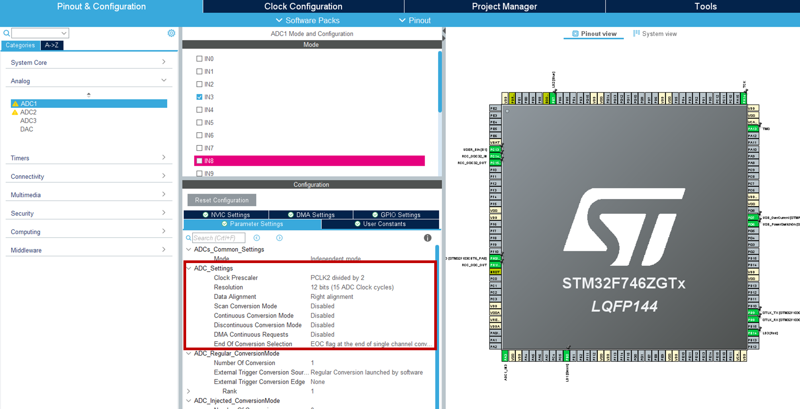
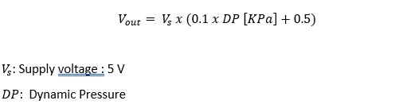
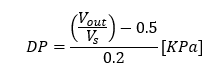
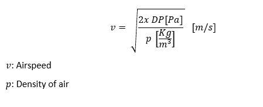
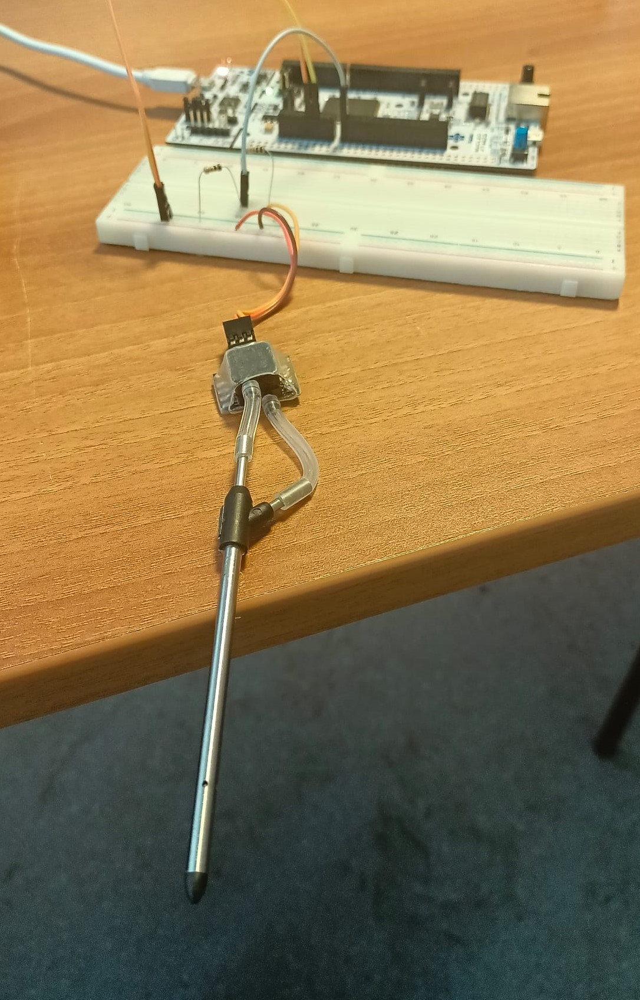
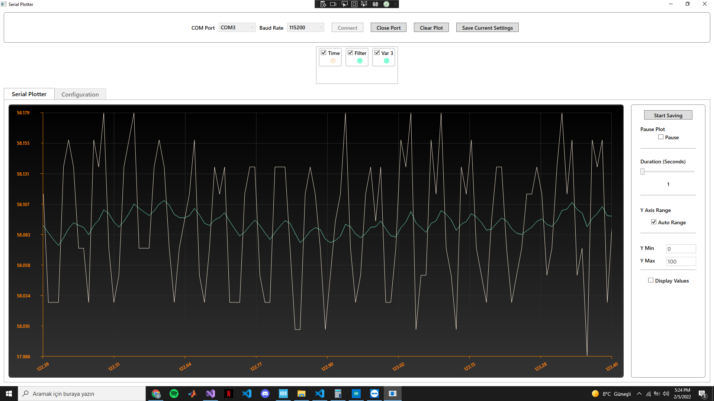

## MPXV7002DP Measurment Airspeed with Kalman Filter in STM32 | STM32 Nucleo Application Series ##

The aim of this project is to measure the relative velocity with respect to the air using the MPXV7002DP pressure sensor and apply it with [FastKalmanFilter](https://github.com/PhiniteLab/fast-kalman-filter "FastKalmanFilter"). 

The datasheet of the sensor is given in the ***/MPXV7/*** folder.

**ADC Configuration**

Reading over STM is done via ADC port set to 12 bits. The corresponding setting can be represented as:

  

**Mathematical Formula**

The value read from the ADC port is converted to voltage with the following formula:

  

The analog output of the MPXV7002DP sensor is between 0-5V. Therefore, reading was made from the analog port of STM32 with a voltage divider circuit. For this, 2 pcs. 10K resistors are used.

The sensor output changes according to the differential pressure (DP) as follows:

  

Based on the voltage value read from this equation, the DP is as follows:

  

The relationship between DP and relative velocity is as follows:

  

**Figure of the System**

  

**Result**

There is a lot of noise, especially in analog measurements. Therefore, filtering is
an indispensable part of sensor design. In this project, a filtering process was
carried out with the [FastKalmanFilter](https://github.com/PhiniteLab/fast-kalman-filter "FastKalmanFilter"). 
the algorithm estimates the state of the system and as the name suggests, while
the correction part is processed, it calculates the filter gain then ‘updates’ the
estimation with respect to the system noise. 

And result can be seen in below with using C# [PhiSerialPlotter](https://github.com/PhiniteLab/phi-serial-plotter "PhiSerialPlotter") Application using UART

  

